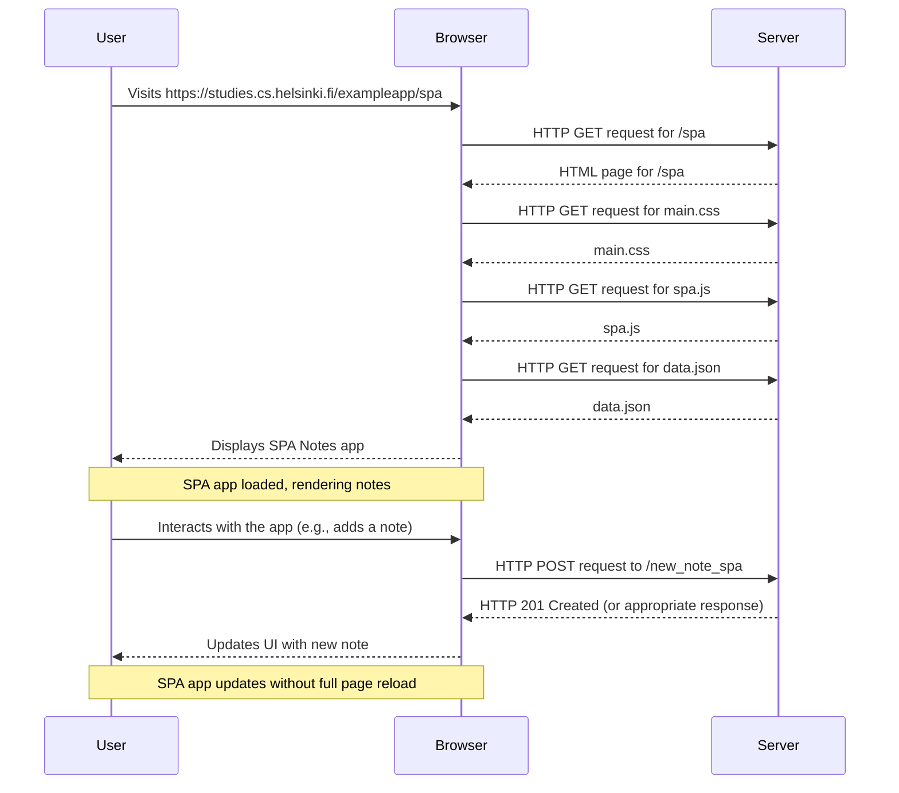

```mermaid
    sequenceDiagram
        participant User
        participant Browser
        participant Server

        User->>Browser: Visits https://studies.cs.helsinki.fi/exampleapp/spa
        Browser->>Server: HTTP GET request for /spa
        Server-->>Browser: HTML page for /spa
        Browser->>Server: HTTP GET request for main.css
        Server-->>Browser: main.css
        Browser->>Server: HTTP GET request for spa.js
        Server-->>Browser: spa.js
        Browser->>Server: HTTP GET request for data.json
        Server-->>Browser: data.json
        Browser-->>User: Displays SPA Notes app

        Note over User,Browser: SPA app loaded, rendering notes

        User->>Browser: Interacts with the app (e.g., adds a note)
        Browser->>Server: HTTP POST request to /new_note_spa
        Server-->>Browser: HTTP 201 Created (or appropriate response)
        Browser-->>User: Updates UI with new note

        Note over User,Browser: SPA app updates without full page reload
```
