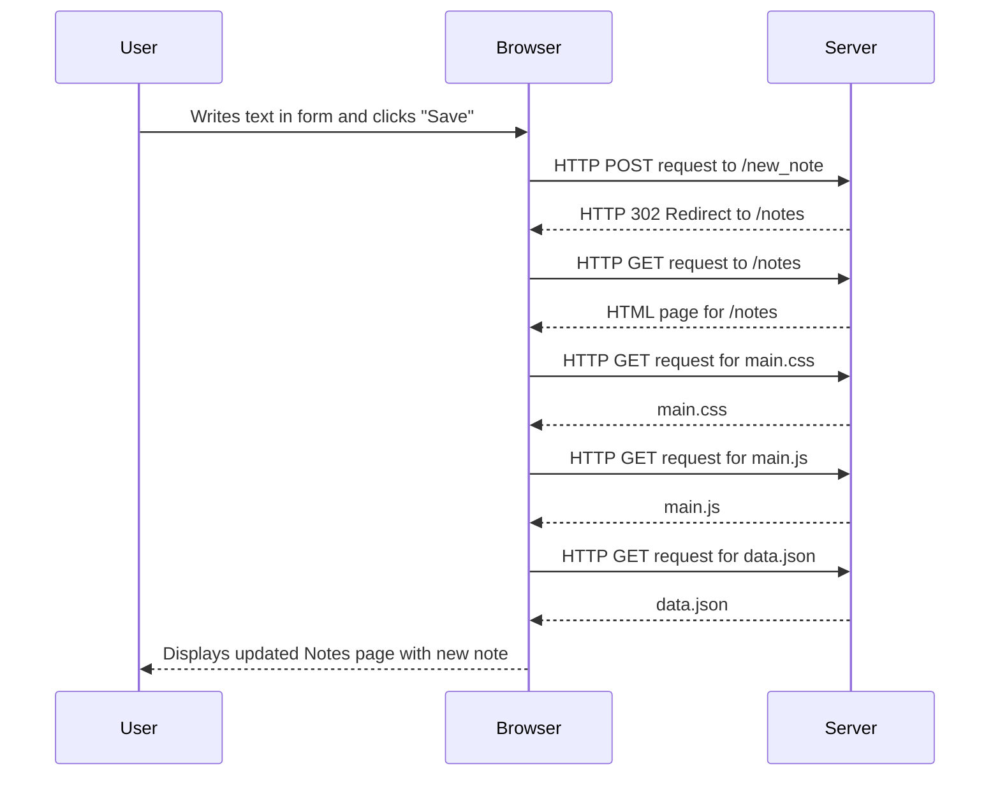

```mermaid
    sequenceDiagram
        participant User
        participant Browser
        participant Server

        User->>Browser: Writes text in form and clicks "Save"
        Browser->>Server: HTTP POST request to /new_note
        Server-->>Browser: HTTP 302 Redirect to /notes
        Browser->>Server: HTTP GET request to /notes
        Server-->>Browser: HTML page for /notes
        Browser->>Server: HTTP GET request for main.css
        Server-->>Browser: main.css
        Browser->>Server: HTTP GET request for main.js
        Server-->>Browser: main.js
        Browser->>Server: HTTP GET request for data.json
        Server-->>Browser: data.json
        Browser-->>User: Displays updated Notes page with new note
```
