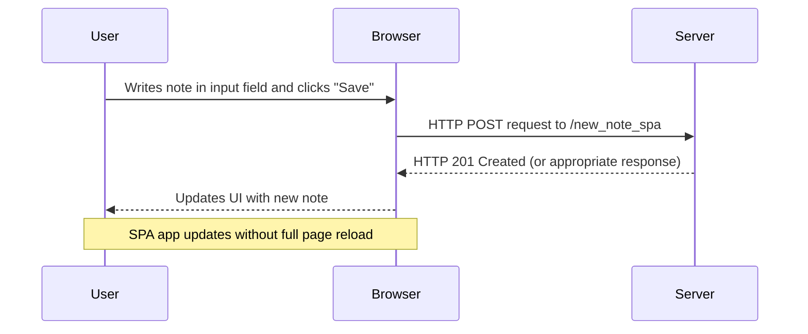

```mermaid
    sequenceDiagram
        participant User
        participant Browser
        participant Server

        User->>Browser: Writes note in input field and clicks "Save"
        Browser->>Server: HTTP POST request to /new_note_spa
        Server-->>Browser: HTTP 201 Created (or appropriate response)
        Browser-->>User: Updates UI with new note

        Note over User,Browser: SPA app updates without full page reload

```
